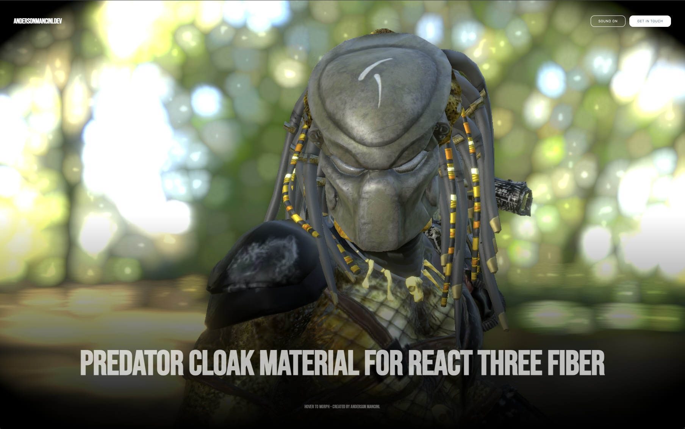

# Predator Cloak Material — React Three Fiber



**Live demo:** [predator-material.vercel.app](https://predator-material.vercel.app/)

## What this is

This project is a technical demo built to show how to create **custom, physically-based glass/transmission materials** in **React Three Fiber** using **WebGPU** and **TSL (Three.js Shading Language)**.

Instead of relying on a static glass preset, the Predator's cloak is a fully procedural `MeshPhysicalNodeMaterial` built with TSL nodes. On hover (or click-and-hold), the character's organic, opaque skin/armor **morphs in real time into a transmissive, glass-like cloaked material**, spreading outward from a shader-driven "dissolve grid," complete with fresnel rim light, shimmer, and animated scan-line rings — all running on the GPU via node-based shaders rather than hand-written GLSL strings.

The scene is rendered with `THREE.WebGPURenderer` (`three/webgpu`), with an optional dev-only GPU inspector, a custom post-processing pipeline (bloom + vignette) built on `RenderPipeline`/TSL passes, and a live "Parameters" panel so every part of the effect can be tweaked and observed in real time.

## Tech stack

- **React 19** + **React Three Fiber 9** (`@react-three/fiber`)
- **`three/webgpu`** — WebGPU renderer with TSL node materials
- **`three/tsl`** — Three.js Shading Language, used to build the material and mask logic as composable JS functions instead of raw shader strings
- **`@react-three/drei`** — `useGLTF`, `Environment`, `OrbitControls`
- **`maath`** — `easing.damp` for smooth, frame-rate independent transitions
- **Vite** — dev server / bundler

## How it works

### 1. A node-based `MeshPhysicalNodeMaterial`

`src/PredatorMaterial/PredatorMaterial.js` builds one `MeshPhysicalNodeMaterial` per mesh (head, body, helmet), reusing the original GLTF textures (`map`, `normalMap`) so the model still looks correct when fully "decloaked." On top of the base PBR material, several TSL node graphs are attached:

- `material.transmissionNode` — drives the glass/transmission amount
- `material.colorNode` — blends the base texture color with the cloak's cell color
- `material.roughnessNode` / `material.metalnessNode` — animate a shimmering, metallic look inside the revealed cells
- `material.emissiveNode` — adds a fresnel rim-light that appears as the effect activates

All of this is driven by **uniforms** (`uniform(...)`) updated every frame, so the transition is smooth and fully GPU-driven — there is no CPU-side geometry manipulation or texture swapping.

### 2. A procedural dissolve mask (`buildGridMask`)

The core of the effect is a shader mask that decides, per-pixel, whether a fragment shows the *original material* or the *cloaked/glass material*. It supports two mask modes, selectable at runtime:

- **UV grid mode** — tiles the surface UVs into a grid of cells and grows/shrinks each cell's visible size based on progress, creating a "digital dissolve" look.
- **Ring mode** (object / world / view space) — expands concentric rings outward from a configurable 3D center point, like an energy field spreading across the body.

### 3. Hover-driven morph animation

`src/Predator.js` uses an invisible hit-target mesh to capture pointer events (hover, pointer down/up) and flips a `cloakActive` boolean. `PredatorCloakMaterial` reads that as `hover` and eases a single `uProgress` uniform (0 → 1) with `maath`'s `easing.damp`, which then drives every visual layer above (transmission, grid mask, shimmer, fresnel) in a synchronized way.

## Key `PredatorCloakMaterial` parameters

These are the main knobs exposed for anyone reusing this material, split by settings file:

### Glass / transmission (`src/glassSettings.js`)

| Parameter | Description |
| --- | --- |
| `transmission` | How "see-through" the cloaked material becomes (0–1) |
| `ior` | Index of refraction of the glass |
| `thickness` | Simulated glass thickness, affects refraction depth |
| `dispersion` | Chromatic aberration / rainbow-splitting on refraction |
| `roughness` / `metalness` | Base PBR surface response |
| `envMapIntensity` | Strength of the environment reflection |
| `fresnelIntensity` / `fresnelColor` | Rim-light color and strength that appears as the cloak activates |
| `clearcoat` / `clearcoatRoughness` | Extra glossy top coat layer |
| `iridescence`, `iridescenceIOR`, `iridescenceThicknessMin/Max` | Thin-film iridescent color shift |
| `sheen`, `sheenRoughness`, `sheenColor` | Soft velvet-like edge highlight |
| `anisotropy`, `anisotropyRotation` | Directional highlight stretching |

### Dissolve grid / mask (`src/gridSettings.js`)

| Parameter | Description |
| --- | --- |
| `projection` | Mask mode: `0` = UV grid, `1`/`2`/`3` = ring mask in object/world/view space |
| `uvScale`, `fadePower`, `sizeMax`, `cellOffset` | Control cell size, tiling density and how the grid dissolve grows with progress |
| `ringDensity`, `ringWidth`, `ringSpeed` | Frequency, thickness and animation speed of the expanding rings |
| `centerX/Y/Z`, `axisScaleX/Y/Z` | 3D origin and per-axis stretch of the ring effect |
| `shimmerSpeed`, `shimmerScale`, `shimmerNormalScale`, `shimmerMin` | Animated metallic shimmer inside revealed cells |
| `cellColor`, `metalnessInCell` | Color and metalness applied inside the mask |

### Cloak trigger (`src/cloakSettings.js`)

| Parameter | Description |
| --- | --- |
| `forceCloak` | Pins the effect fully "on" regardless of hover state (used by the "Pin Cloak" UI button, handy for recording) |

All of these are plain mutable JS objects exposed on `window` in dev mode (`__glassSettings`, `__gridSettings`, `__cloakSettings`), and are also wired into a live dev-only GPU inspector panel (`src/setupGlassInspector.js`), so values can be tuned visually and copied back into the source.

## Why this is technically advanced

This isn't just "a glass shader." Several non-trivial techniques are combined into a single, coherent, real-time effect:

1. **It's a material transition, not just a glass effect.** Every frame, two entirely different material descriptions — an opaque textured PBR material and a transmissive dielectric glass material — are blended together *per-pixel* based on a dynamic mask, rather than switching between two materials or cross-fading opacity. Color, roughness, metalness, and emissive are each independently interpolated (`mix(...)`) between their "before" and "after" states, so the surface genuinely morphs its physical properties, not just its appearance.

2. **The transition boundary is a dynamic, animated mask — not a simple fade.** The dissolve isn't a linear opacity ramp; it's a procedurally generated boundary (grid cells growing per-row, or rings expanding from a 3D point) that itself animates over time (`uTime`) independently of the transition progress (`uProgress`). That means the mask has its own internal motion (scan-line rings pulsing, shimmer oscillating) layered on top of the overall reveal, similar to techniques used for sci-fi "hologram" or "cloaking device" VFX in film/game production.

3. **The mask can operate in multiple coordinate spaces.** The same mask function supports UV space, object space, world space and view space projections, selected at runtime via a single uniform (`select(...)` branching entirely on the GPU, no CPU recompilation). This makes the effect adaptable to different mesh topologies (the head, body and helmet each use different grid dimensions) without rewriting the shader.

4. **Everything is authored in TSL, not string-based GLSL.** The entire node graph — masks, blends, fresnel, shimmer — is written as composable JavaScript functions (`Fn`, `mix`, `smoothstep`, `select`, `dot`, `length`, `fract`, etc.) that Three.js compiles down to the appropriate shader code for the active backend (WebGPU/WGSL, with WebGL2/GLSL fallback support built into Three.js's node system). This keeps the shader logic readable, composable, and reusable as plain functions instead of opaque strings.

5. **It runs on WebGPU with a custom render pipeline.** The scene uses `THREE.WebGPURenderer` and a hand-built `RenderPipeline` (`src/Effects.js`) combining a TSL bloom pass and a procedural vignette, rather than the classic `EffectComposer`. In development, a live GPU inspector is attached to visualize render passes and tune uniforms without editing code.

## Project structure

```
src/
├── PredatorMaterial/
│   └── PredatorMaterial.js   # The core TSL node material + dissolve mask
├── Predator.js                # Loads the GLTF, wires up hover/click interactions
├── Canvas.js                  # R3F <Canvas>, WebGPU renderer setup, camera sway
├── Effects.js                 # Post-processing: bloom + vignette via RenderPipeline
├── glassSettings.js           # Glass/transmission PBR parameters
├── gridSettings.js            # Dissolve mask parameters
├── cloakSettings.js           # Global cloak trigger (pin on/off)
├── hoverSettings.js           # Shared hover/holding state
├── setupGlassInspector.js     # Dev-only live parameter inspector
└── Overlay.js                 # HTML UI (sound toggle, pin cloak, hints)
```

## Running locally

```bash
npm install
npm run dev
```

Requires a browser with WebGPU support (recent Chrome/Edge). Open the dev-only Inspector panel to live-tune the glass and grid parameters described above.
